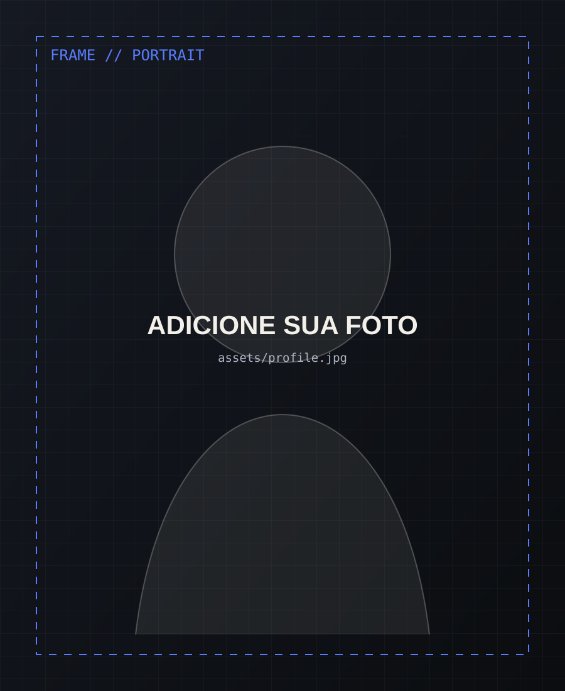

# Pedro Luís — Portfolio Front-End / Creative

Portfólio autoral em HTML, CSS e JavaScript puro, criado para apresentar **Pedro Luís Bezerra Lima** como Desenvolvedor Front-End em formação com repertório criativo multidisciplinar.

## Conceito visual

**Creative Signal / Digital Atelier**: uma identidade editorial e cinematográfica que combina:

- fundo grafite quase preto;
- branco-papel para contraste e legibilidade;
- azul elétrico no modo **DEV**;
- coral no modo **ART**;
- verde-lima/ciano como sinal de energia e interação;
- grids, contact sheets e marcações de frame como referência a design, fotografia, vídeo e processo criativo.

A ideia não é parecer apenas um “template de programador”. O site comunica duas dimensões: **construção técnica** e **direção visual**.

## O que já está implementado

- Hero animado com Canvas generativo.
- Modo **DEV / ART** que muda o sotaque visual do site.
- Navegação responsiva e barra de progresso de rolagem.
- Command Palette com `Ctrl + K`.
- Projetos renderizados via JavaScript e filtros por categoria.
- Modal de estudo de caso para cada projeto.
- Seção de competências baseada nos 15 módulos fornecidos da EBAC.
- Indicador de progresso atual do curso: **44%**.
- Playground interativo de DOM (“Creative Lab”).
- Timeline de experiência/formação.
- Área de fotografia, ilustração, vídeo/motion e processo criativo.
- Animações por `IntersectionObserver`.
- Tilt, cursor customizado e botões magnéticos em dispositivos compatíveis.
- Suporte a `prefers-reduced-motion`.
- Layout adaptado para desktop, tablet e celular.
- Sem frameworks e sem dependências de runtime.

## Como executar

Na pasta do projeto:

```bash
npm run dev
```

Abra:

```text
http://127.0.0.1:4173
```

Verificar sintaxe:

```bash
npm run check
```

## 1. Adicionar sua foto

Coloque uma imagem em:

```text
assets/profile.jpg
```

No `index.html`, procure:

```html

```

e substitua por:

```html

```

Prefira um retrato vertical com boa luz e fundo simples ou uma foto com direção artística coerente com o site.

## 2. Adicionar projetos reais

Abra:

```text
js/main.js
```

No começo existe:

```js
const projects = [ ... ];
```

Cada item possui:

```js
{
  id: "p01",
  number: "01",
  title: "Nome do projeto",
  category: "frontend",
  categoryLabel: "Front-End",
  year: "2026",
  image: "./assets/meu-projeto.jpg",
  summary: "Resumo curto.",
  stack: ["HTML", "CSS", "JavaScript"],
  role: "O que você fez.",
  challenge: "Qual problema resolveu.",
  result: "Resultado e aprendizado."
}
```

Categorias disponíveis atualmente:

- `frontend`
- `javascript`
- `creative`

Você pode adicionar quantos projetos quiser.

### O que colocar em cada case study

Prefira mostrar processo, e não apenas screenshot:

1. contexto;
2. problema;
3. seu papel;
4. decisões importantes;
5. restrições;
6. implementação;
7. responsividade e acessibilidade;
8. resultado;
9. o que faria diferente hoje.

## 3. Adicionar GitHub e LinkedIn

No `index.html`, procure:

```html
data-placeholder-link="linkedin"
data-placeholder-link="github"
```

Remova `data-placeholder-link` e substitua `href="#"` pelas URLs reais.

Exemplo:

```html
<a href="https://github.com/SEU-USUARIO" target="_blank" rel="noreferrer">GitHub</a>
```

## 4. Adicionar currículo em PDF

Coloque o arquivo em:

```text
assets/curriculo-pedro.pdf
```

Depois substitua o link placeholder por:

```html
<a href="./assets/curriculo-pedro.pdf" download>Currículo PDF</a>
```

> O número de telefone e o endereço completo presentes no currículo original **não foram publicados no site por padrão**, para evitar exposição desnecessária de dados pessoais. Você pode adicioná-los conscientemente se quiser.

## 5. Adicionar trabalhos criativos

A seção **O que alimenta meu olhar** foi deixada propositalmente como base para:

- ilustrações digitais;
- desenhos feitos à mão;
- motion design;
- edição de vídeo;
- fotografia;
- frames de animação;
- making-of e processo.

Troque os blocos `.contact-frame__media` por ``, `<video>` ou thumbnails próprias.

## Competências representadas no site

Com base no material de progresso fornecido:

- fundamentos do desenvolvimento web;
- HTML5 semântico e acessível;
- CSS3;
- JavaScript: variáveis, tipos, operadores, funções e debugging;
- algoritmos, pseudocódigo, fluxogramas, condicionais, loops e arrays;
- POO: classes, construtor, encapsulamento, herança e polimorfismo;
- DOM, `getElementById`, `querySelector`, eventos e `preventDefault`;
- Fetch API, Promises, Web Storage (`localStorage` e `sessionStorage`);
- HTTP/HTTPS e ciclo de requisição;
- JavaScript moderno: `let`, `const`, arrow functions, Promises, async/await, funções de alta ordem e imutabilidade;
- Git/GitHub: branches, commits, push, merge conflicts e Pull Requests;
- responsividade, media queries, unidades relativas, Flexbox e CSS Grid;
- BEM;
- Sass: Node/NPM, variáveis, nesting, partials, `@use`, mixins e herança;
- Bootstrap: Grid System, componentes, customização Sass e CDN;
- Tailwind CSS: instalação/NPM/CLI, utility classes, breakpoints e mobile first.

## Conteúdo profissional usado

- Nome: Pedro Luís Bezerra Lima.
- Técnico em Informática.
- Em formação em Desenvolvimento Front-End pela EBAC — progresso informado: 44%.
- Experiência World Cel (2025): atendimento, suporte técnico, venda e audiovisual.
- Minicurso de Cyber Segurança (2024): ministrante e organizador.
- Ensino Médio integrado ao Técnico em Informática — Unidade Escolar Dr. Dionísio Rodrigues Nogueira (2024).
- Base: Parnaguá, Piauí, Brasil.
- Idiomas: Português nativo, Inglês médio-avançado e Espanhol médio.
- Contato publicado: `daxstudios.comissions@gmail.com`.

## Deploy

Por ser um site estático, pode ser publicado facilmente em:

- GitHub Pages;
- Netlify;
- Vercel;
- Cloudflare Pages.

O arquivo `server.mjs` serve apenas para desenvolvimento local.

## Estrutura

```text
pedro-portfolio/
├── index.html
├── styles.css
├── package.json
├── server.mjs
├── README.md
├── assets/
│   ├── favicon.svg
│   ├── profile-placeholder.svg
│   └── project-01.svg ... project-06.svg
└── js/
    └── main.js
```
